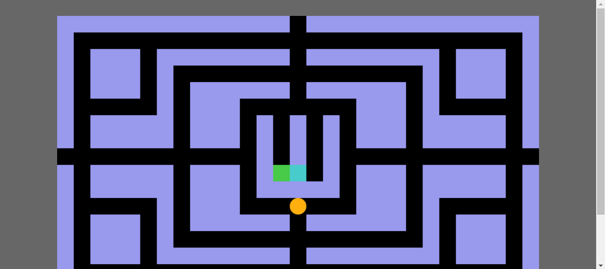

# JOGO DO PACMAN
☑️JOGO EM HTML/CSS/JS.

   

## DESCRIÇÃO:
Este é um jogo simples em um ambiente de canvas HTML5, onde o jogador controla um personagem (representado pelo pacman) que pode mover-se para cima, baixo, esquerda ou direita em um labirinto, evitando paredes e coletando pontos.

- Define variáveis ​​para elementos do HTML, contexto do canvas, dimensões do labirinto, posição do pacman, posição dos fantasmas, entre outras.
- Define variáveis ​​de controle para as setas do teclado.
- Define um relógio para atualizar o movimento do pacman e dos fantasmas.
- `moverPacman()`: Atualiza a posição do pacman com base nas setas do teclado pressionadas.
- `moverGhost()`: Move os fantasmas pelo labirinto.
- `pausar()`: Pausa ou continua o jogo, interrompendo ou reiniciando o relógio de atualização.
- `atualizaPacman()`: Atualiza o movimento do pacman.
- `atualizaGhosts()`: Atualiza o movimento dos fantasmas.
- `novoJogo()`: Inicia um novo jogo, redefinindo o mapa do labirinto, posição do pacman, posição dos fantasmas, entre outras configurações.
- `desenharTudo()`: Limpa o canvas e desenha o labirinto, o pacman, os pontos e os fantasmas.
- Adiciona um ouvinte de evento de pressionamento de tecla para controlar o movimento do pacman com as setas do teclado.

Este jogo pode ser expandido com mais funcionalidades, como pontos de poder, pontos de bônus, diferentes níveis de dificuldade, entre outros. Além disso, a aparência visual e a mecânica do jogo podem ser melhoradas para torná-lo mais envolvente.

## NÃO SABE?
- Entendemos que para manipular arquivos em `HTML`, `CSS` e outras linguagens relacionadas, é necessário possuir conhecimento nessas áreas. Para auxiliar nesse aprendizado, oferecemos cursos gratuitos disponíveis:
* [CURSO DE CANVAS](https://github.com/VILHALVA/CURSO-DE-CANVAS)
* [CURSO DE HTML E CSS](https://github.com/VILHALVA/CURSO-DE-HTML-E-CSS)
* [CURSO DE JAVASCRIPT](https://github.com/VILHALVA/CURSO-DE-JAVASCRIPT)
* [CONFIRA MAIS CURSOS](https://github.com/VILHALVA?tab=repositories&q=+topic:CURSO)

## CREDITOS:
- [PROJETO CRIADO PELO "LuizCarlosVilela"](https://github.com/LuizCarlosVilela/Pacman-JS)
- [PROJETO EDITADO PELO VILHALVA](https://github.com/VILHALVA)
